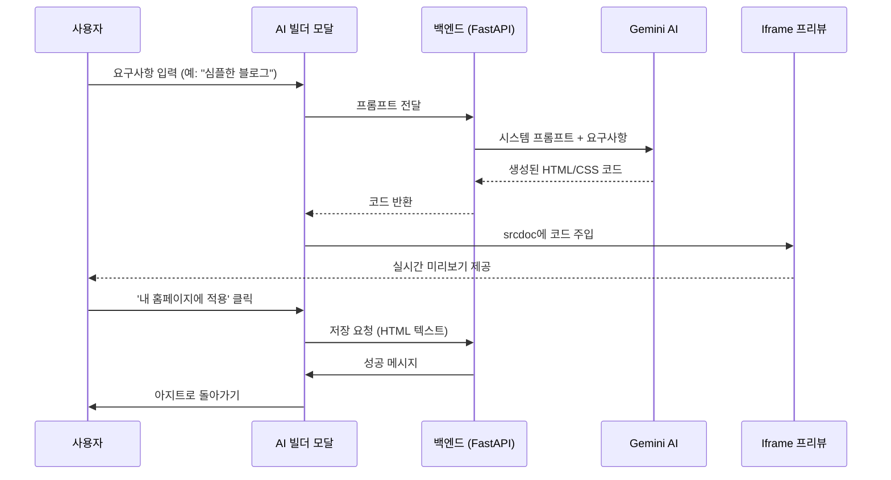

# Wire Flow: AI Homepage Builder

## 1. 화면 목록 (Screen List)

| 화면 ID | 화면 명 | 설명 | 주요 요소 |
| :--- | :--- | :--- | :--- |
| SCR-001 | 메인 아지트 | 사용자의 개인 홈페이지 메인 | 관리자 버튼, 게시판, 방명록 |
| SCR-002 | 관리자 모달 | 홈페이지 설정 및 관리 창 | AI 도우미 버튼, 테마 설정 |
| SCR-003 | AI 빌더 모달 | AI와 대화하며 사이트 제작 | 채팅창, 실시간 Iframe 프리뷰, 적용 버튼 |
| SCR-004 | 적용 완료 알림 | 저장이 완료되었음을 알림 | 성공 메시지, 닫기 버튼 |

## 2. 주요 흐름 (Main Flow)

### 2.1 AI를 통한 홈페이지 생성 흐름

## 3. 화면 상세 설계 (UI Detail)

### 3.1 AI 빌더 모달 (SCR-003)
- **좌측 (Chat Area)**:
    - AI와 주고받은 메시지 히스토리.
    - 하단 텍스트 입력 창 및 전송 버튼.
- **우측 (Preview Area)**:
    - `<iframe>` 영역.
    - 생성된 코드가 렌더링되어 독립적인 페이지처럼 표시됨.
- **상단/하단 (Control Area)**:
    - `[적용하기]`, `[다시 생성]`, `[취소]` 버튼.
